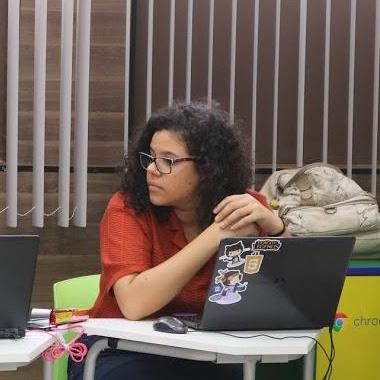

<h1 align="center">
  
</h1>

<h4 align="center">
  Merecemos biscoitos :cookie:
</h4>

  <a href="#ghost-tecnologias">Tecnologias</a>&nbsp;&nbsp;&nbsp;|&nbsp;&nbsp;&nbsp;
  <a href="#computer-projeto">Projeto</a>&nbsp;&nbsp;&nbsp;|&nbsp;&nbsp;&nbsp;
  <a href="#rocket-iniciando-aplicação">Iniciando aplicação</a>&nbsp;&nbsp;&nbsp;|&nbsp;&nbsp;&nbsp;
  <a href="#door-back-end">Back-end</a>&nbsp;&nbsp;&nbsp;|&nbsp;&nbsp;&nbsp;
  <a href="#art-front-end">Front-end</a>

 

  

## :ghost: Tecnologias

Esse projeto foi desenvolvido com as seguintes tecnologias:

- [React.js](https://pt-br.reactjs.org/)
- [Node.js](https://nodejs.org/en/)
- [AdonisJS](https://adonisjs.com/)
- [Docker](https://docs.docker.com/)
- [Postgres](https://www.postgresql.org/)

## :computer: Projeto

O projeto consiste em...

## :rocket: Iniciando aplicação

- Configure o backend em: <a href="https://github.com/brendamatias/biscoitxs-api">Backend</a>
- Clone este repositório usando `git clone https://github.com/brendamatias/biscoitxs`;
- Mova-se para diretório da aplicação: `cd biscoitxs`;
- Execute `yarn install` ou `npm install` para instalar as dependências;
- Inicie a aplicação com `yarn serve` ou `npm serve`;

## Team

Time de pessoas maravilhosa ([emoji key](https://allcontributors.org/docs/en/emoji-key)):

<table>
  <tr>
    <td align="center">
      <a href="https://www.linkedin.com/in/alessa-alves-/">
        
         
        <b>Alessa Alves</b>
      </a>
       
      <a href="https://github.com/alessaalves"title="projectManagement">📆</a>
    </td>
    <td align="center">
      <a href="https://www.linkedin.com/in/brenda-matias/">
        
         
        <b>Brenda Matias</b>
      </a>
       
      <a href="https://github.com/brendamatias"title="Code">💻</a>
    </td>
    <!-- <td align="center">
      <a href=" ">
        
         
        <b>Fabiana Barros</b>
      </a>
       
      <a href=""title="Code">💻</a>
    </td> -->
    <td align="center">
      <a href="https://www.linkedin.com/in/nelkisamatias/">
        
         
        <b>Nelkisa Matias</b>
      </a>
       
      <a href="https://github.com/gabriias"title="Code">💻</a>
    </td>

  </tr>
</table>
